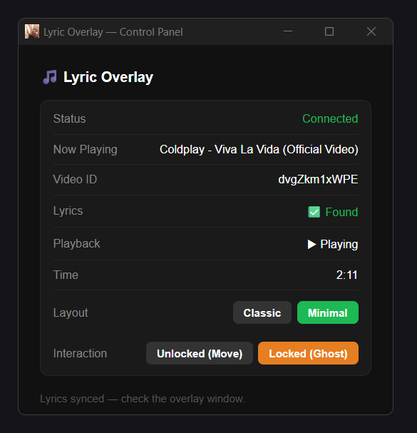
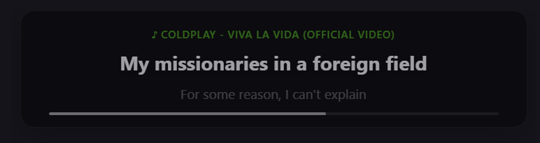
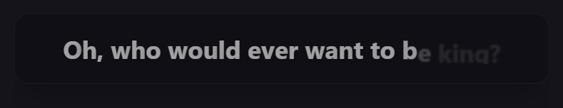
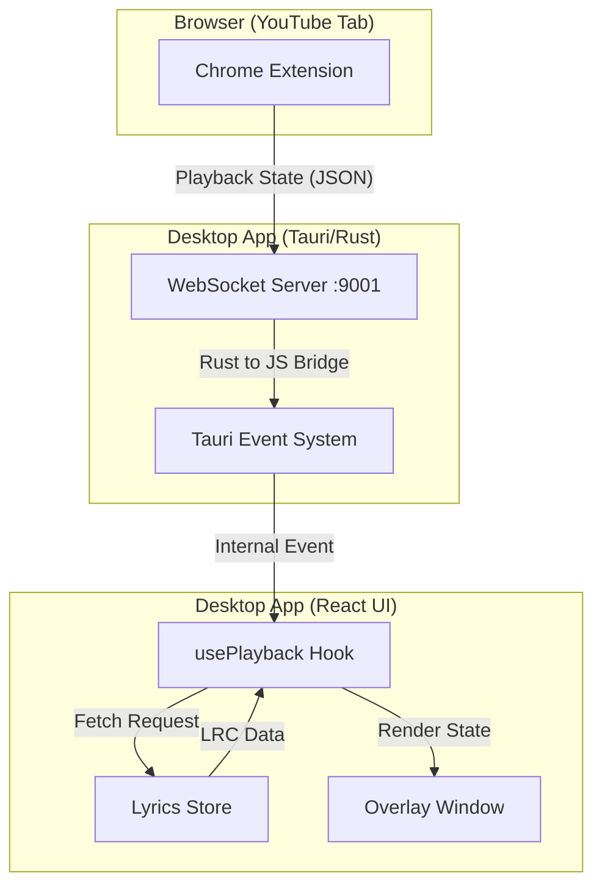

# 🎵 Lyric Overlay: The Ultimate Desktop Companion

Lyric Overlay is a two-part system designed to bring beautiful, synchronized lyrics directly to your desktop while you enjoy music on YouTube.

## 🚀 How it Works

The system consists of two simple parts working together:
1.  **The Browser Extension**: Sits in your browser and "listens" to the music you play on YouTube.
2.  **The Desktop App**: A beautiful, floating window that displays the lyrics on your screen.

---
## Preview

### Main Pannel

### Classic Mode

### Minimal Mode

---
## 📥 Installation & Setup

### 1. The Desktop App
1. download the exe file

### 2. Install the Browser Extension
To add the listener to your browser:
1. Open Chrome/Edge and go to `chrome://extensions`.
2. Turn on **Developer mode** (top right).
3. Click **Load unpacked** and select the `extension` folder from this project.

---

## 🏗 Core Architecture

Lyric Overlay is built on a high-performance, real-time data bridge between your web browser and your desktop environment.

### 🔄 Data Flow

## 📖 Lyrics Store (Fetch & Cache)

The project features a robust lyrics management system designed to find accurate lyrics even with messy YouTube titles.

### 🔍 Multi-Strategy Fetching
When a song starts, the system tries four sequential strategies via the **lrclib.net** API:
1.  **Artist + Track**: The most accurate (e.g., "Artist - Song Title").
2.  **Track Only**: Useful if the artist name isn't clearly separated.
3.  **Swapped Discovery**: Tries swapping artist/track positions to handle "Title - Artist" patterns.
4.  **Raw Search**: Uses the first 60 characters of the raw YouTube title as a last resort.

### 🧹 Smart Title Parsing
The **YouTube Title Parser** automatically cleans metadata to improve search hits by removing:
- Common suffixes: `(Official Video)`, `[MV]`, `Music Audio`, `HD/4K`.
- Features: `(feat. Artist)`, `ft. Artist`.
- Extra info: Standalone years like `(2024)` and various bracket styles.

### 💾 Caching & Overrides
- **In-Memory Cache**: All fetched lyrics are stored in a session-based `Map`, ensuring that switching back to a previous song is instantaneous and saves bandwidth.
- **Manual Overrides**: For songs where auto-fetching fails or is incorrect, you can provide a direct Video ID mapping in `lyricsStore.ts` to load a custom LRC string.
- **LRC Conversion**: If only plain-text lyrics are available, the system automatically converts them into a pseudo-LRC format (distributing lines 3 seconds apart) to maintain a functional UI experience.

---

## 💡 How to Use

1.  **Start the Desktop App**.
2.  **Go to YouTube** and play any song.
3.  **Watch the Magic**: The lyrics will automatically appear in the floating panel on your desktop.

---

## ✨ Features You'll Love

- **Fully Draggable**: Don't like where the lyrics are? Just click and hold anywhere on the panel to move it to your favorite spot.
- **Click-Through Transparency**: The space around the lyrics is "invisible" to your mouse, so you can keep working or gaming without the app getting in your way.
- **Glassmorphic Design**: A modern, blurred background that looks stunning on any wallpaper.
- **Custom Sync**: Use your keyboard to perfectly align lyrics if they ever get slightly out of time.

---

*Made with ❤️ for music lovers everywhere.*
